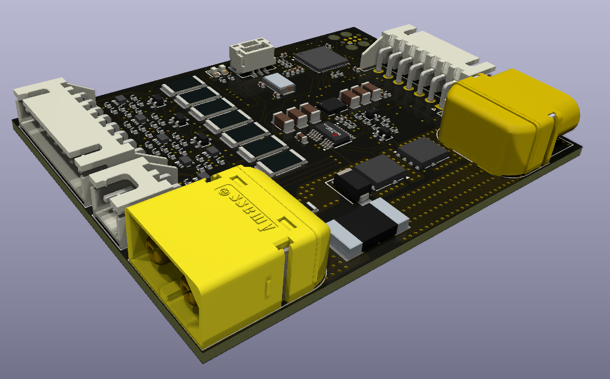
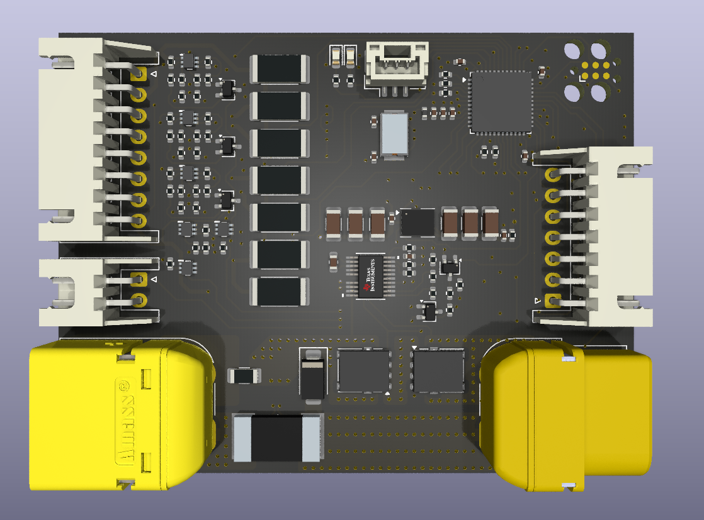

# OpenBMS


OpenBMS is an **open-source battery management system** for 2 to 7-cell Li-Ion and Li-Po battery packs. A fully integrated hardware and firmware solution for battery management and protection, providing:
-  **Fuel gauge** — measure battery capacity, state of charge, and state of health
-  **Learning algorithms** — learn battery behavior and adjust management accordingly
-  **Cell balancing** — keep multi-cell voltages in sync to prevent drift over time
-  **Protection** — guard against overcharging, overdischarging, overheating, and short circuits
-  **Communication** — talk to chargers, displays, microcontrollers, and other devices

<table>
  <tr>
    <td></td>
    <td></td>
  </tr>
</table>

## Related repositories

[OpenBMS-firmware](https://github.com/open-batt/openbms-firmware)  
[OpenBMS-load-hardware](https://github.com/open-batt/openbms-load-hardware)

## How OpenBMS fits into system?

Battery system consists of:
- Li-ion/Li-po battery - your custom 2 to 7-cell battery
- OpenBMS
- Host - I2C/CAN interfaces, wake-up signal, can be a microcontroller, computer, etc.
- Load - your piece of equipment that draws energy from the battery. We also provide [OpenBMS-load-hardware](https://github.com/open-batt/openbms-load-hardware), a 600W resistive load for easier BMS development and testing
- Charger - your custom charger, usually a CC/CV charger adjusted to your battery voltage and current
  


## ❤️ Funding

This project is funded through [NGI0 Commons Fund](https://nlnet.nl/commonsfund), a fund established by [NLnet](https://nlnet.nl) with financial support from the European Commission's [Next Generation Internet](https://ngi.eu) program. 

[](https://nlnet.nl)
[](https://nlnet.nl/commonsfund)

We are very grateful to the NLnet team for helping us on our path, and we encourage you too to apply and get funds to build your project! 🚀
Learn more at the [NLnet project page](https://nlnet.nl/project/OpenBMS).


## ⚠️ Status: Work in progress

| Module | Status |
|--------|--------|
| OpenBMS Schematics | ✅ Done |
| OpenBMS PCB Layout | ✅ Done |
| OpenBMS Hardware | 🏭 Manufacturing |
| Firmware & Algorithms | 🔜 Planned |
| Desktop app |  🚧 In progress |
| Test Platform Development (OpenBMS Load) Schematic & PCB Layout |  ✅ Done |
| OpenBMS Load Hardware | 🏭 Manufacturing |
| BMS Tests |  ❌ Not started |
| Documentation | ❌ Not started |

## Features

- 🔋 Supports pack voltages up to 30V and continuous currents up to 16A.
- ⚡ State of Charge (SoC) estimation using coulomb counting
- 🩺 State of Health (SoH) monitoring with capacity fade tracking and internal resistance estimation
- 📊 Per-cell voltage monitoring with 24-bit resolution
- 🔌 Pack and cell overcurrent protection up to 20A hardware trip (adjustable threshold)
- 🛡️ Overvoltage and undervoltage protection (adjustable thresholds)
- 🔀 Passive cell balancing for up to 7 cells
- 🔵 Battery current measurement via precision shunt resistor
- 🌡️ NTC thermistor input for battery temperature monitoring
- 🌡️ On-board ambient temperature monitoring via MCU and ADC internal sensors
- 💾 Non-volatile storage of SoC, SoH, impedance, fault history, and charge profiles (EEPROM)
- 🚌 CAN bus communication interface (up to 1 Mbit/s)
- 🔗 I2C communication interface for host integration (SMBus compatible)
- 🖥️ UART debug interface
- 🔔 Wake-up input with power-on latch for low-power system control
- 🔋 Power-down mode quiescent current < 2 µA
- 🖥️ Based on STM32L431 ARM Cortex-M4 microcontroller
  
## Overview
First, a small introduction to the project structure:
```
+-------------+       +---------------------------+       +----------------+
|             |       |         OpenBMS           |       |                |
|   Battery   |       | - - - - - - - - - - - - - |       |     System     |
| 2-7S Li-Ion | cells |   +-------+   +-------+   |       |                |
| 2-7S Li-Po  |- - - >|   |  ADC  |   |  MCU  |   |<----->|    host/load   |
|             |       |   +-------+   +-------+   | comms |                |
|             |<=====>|   +-------+   +-------+   |<=====>|     Charger    |
|             |  pwr  |   | Power |   | FETs  |   |  pwr  |                |
+-------------+       |   +-------+   +-------+   |       +----------------+
                       +-----------+--------------+
```

OpenBMS and the battery are designed to be a single, inseparable unit. Ideally, it is
connected on the first day of the battery's life and stays throughout its entire lifetime.
This way, OpenBMS learns the battery's characteristics over time and continuously tracks
its state of health and other parameters.
 
It protects the battery from overcurrent, overvoltage, and undervoltage conditions, and
balances cells to maximize pack lifetime. State of charge estimation tells you exactly how
much energy you have left, while long-term health monitoring tells you when it's time to
replace the battery.
 
The battery communicates with the host system via CAN bus or I2C. Through OpenBMS, the battery can:
- Give energy to the system (discharge)
- Take energy from the system (charge)
 
OpenBMS can be easily described with the following block diagram:

```
+---------------------------------------------------------------------------------------------------------------+
|                                                  OpenBMS                                                      |
|                                                                                                               |
|  +-----------------------+     power     +-------------------+     power     +-------------------------+      |
|  |    Battery Input      |<=============>|  Switch Circuit   |<=============>|         Output          |      |
|  | - - - - - - - - - - - |               | - - - - - - - - - |               | - - - - - - - - - - - - |      |
|  | + XT60 pwr connector  |               | + Main NFETs      |               | + XT60 pwr connector    |      |
|  | + 8-pin JST (balancer)|               | + Precharge FETs  |               | + JST (I2C,CAN,WAKE_UP) |      |
|  | + 2-pin JST (NTC)     |               +--------+----------+               +-------------------------+      |
|  +-----------------------+                         |                                      ^                   |
|            |                                       | ctr signals                          | can, i2c, wake_up |
|            | cells                                 v                                      |                   |
|  +---------------------+       SPI      +-------------------------+                       |                   |
|  |    Analog Block     |<==============>|     Digital Block       |=======================+                   |
|  |     (ADS131M08)     |                | - - - - - - - - - - - - |                                           |
|  | - - - - - - - - - - |                | + STM32L431 (Cortex-M4) |                                           |
|  | + Cell voltage x7   |                | + EEPROM                |                                           |
|  | + Pack voltage      |                | + LED indicators        |                                           |
|  | + Current           |                | + SWD / UART debug      |                                           |
|  | + PFETs cell switch |                | + I2C / CANinterfaces   |                                           |
|  +---------------------+                +-------------------------+                                           |
|                                                     ^                                                         |
|                                                     | 3.3V, wake_up                                           |
|                                          +----------+---------+                                               |
|                                          | 3.3V Power Supply  |                                               |
|                                          | - - - - - - - - -  |                                               |
|                                          | + Buck converter   |                                               |
|                                          | + Enable latch     |                                               |
|                                          +--------------------+                                               |
|                                                                                                               |
+---------------------------------------------------------------------------------------------------------------+
```

## Characteristics

| Parameter                                    | Value                                             |
|----------------------------------------------|---------------------------------------------------|
| Cell count                                   | 2 to 7 cells                                      |
| Supported chemistries                        | Li-Ion, Li-Po                                     |
| Communication interfaces                     | CAN bus (up to 1 Mbit/s), I2C (SMBus compatible)  |
| Maximum pack voltage                         | 30.1V (7 cells × 4.3V)                            |
| Minimum pack voltage                         | 4V (2 cells × 2V)                                 |
| Maximum continuous current                   | 16A                                               |
| Maximum peak current                         | 20A (hardware trip)                               |
| Current consumption (active, 7-cell, max)    | 6mA                                               |
| Current consumption (active, 7-cell, typ)    | 4mA                                               |
| Current consumption (active, 2-cell, max)    | 19mA                                              |
| Current consumption (active, 2-cell, typ)    | 13mA                                              |
| Power-down quiescent current                 | < 2 µA                                            |
| Operating temperature range                  | -40°C to 85°C                                     |

## License

OpenBMS is licensed under the MIT license and CERN OHL-S v2.

Check [openbatt.dev](https://openbatt.dev) for more!
